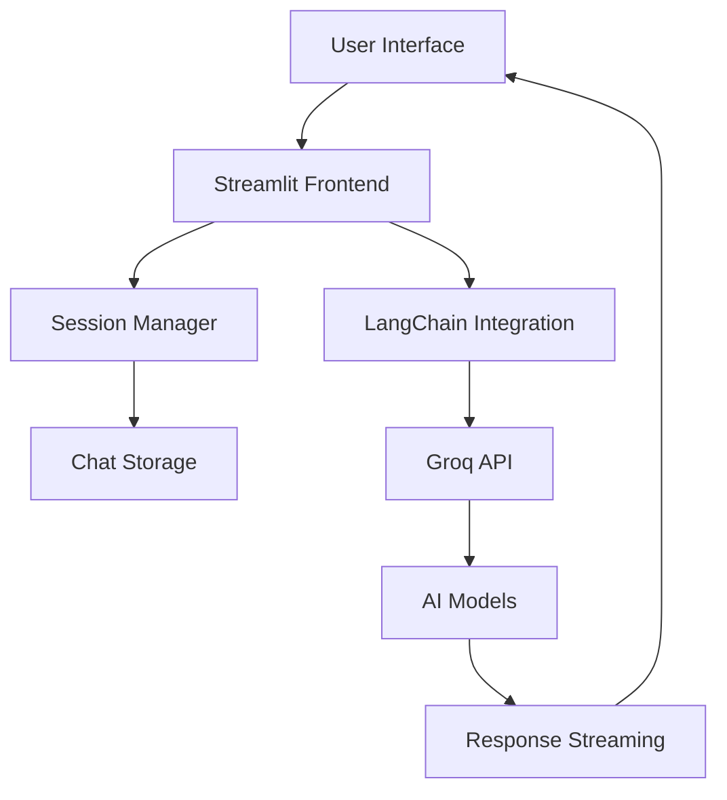

I'll reconstruct the README from the screenshot content in a clean, properly formatted way:

```markdown
<div align="center">

# Gynx Ai Chat Interface


**Advanced AI Assistant with Conversation Memory | Context-Aware Responses | Multi-Model Support**

[](https://gynx-ai.streamlit.app)
[](https://github.com/muhammadawaislaal/gynx-ai/issues)
[](https://github.com/muhammadawaislaal/gynx-ai/issues)

</div>

## 📋 Table of Contents
- [✨ Features](#features)
- [🚀 Quick Start](#quick-start)
- [🛠️ Installation](#installation)
- [⚙️ Configuration](#configuration)
- [💬 Usage Guide](#usage-guide)
- [🏗️ Architecture](#architecture)
- [🔧 API Reference](#api-reference)
- [🎨 UI Components](#ui-components)
- [🔒 Security](#security)
- [🤝 Contributing](#contributing)
- [📄 License](#license)
- [👨‍💻 Developer](#developer)

## ✨ Features

### 🎯 Core Features
- **🤖 Multi-Model AI Support** - Access to 7+ cutting-edge LLMs via Groq API
- **💬 Intelligent Conversation Memory** - Maintains context across 6+ previous messages
- **⚡ Real-time Streaming Responses** - Dynamic text streaming with typing effect
- **📱 Session Management** - Create, switch, and manage multiple chat sessions
- **🎨 Beautiful Chat Interface** - Modern, responsive UI with custom CSS styling

### 🛡️ Professional Features
- **🔧 Adjustable Parameters** - Fine-tune creativity, response length, and model selection
- **📊 Conversation History** - Persistent chat sessions with timestamps
- **⚙️ Advanced Model Settings** - Temperature, max tokens, top-p, frequency penalty
- **🔄 Dynamic Session Switching** - Seamlessly switch between different conversations

### 🚀 Technical Highlights
- LangChain integration for robust conversation chains
- Streamlit secrets management for secure API keys
- UUID-based session tracking
- Real-time logging and error handling
- Responsive design with custom CSS

## 🚀 Quick Start

### Prerequisites
- Python 3.9+
- Groq API Key (get from [Groq Console](https://console.groq.com))
- Streamlit account (for deployment)

### One-Line Installation
```bash
pip install streamlit langchain-groq python-dotenv && streamlit run app.py
```

## 🛠️ Installation

### Method 1: Local Installation
```bash
# Clone the repository
git clone https://github.com/muhammadawaislaal/gynx-ai.git
cd gynx-ai

# Create virtual environment
python -m venv venv

# Activate virtual environment
# Windows:
venv\Scripts\activate
# Mac/Linux:
source venv/bin/activate

# Install dependencies
pip install streamlit langchain-groq python-dotenv uuid

# Run the application
streamlit run app.py
```

### Method 2: Docker Installation
```bash
# Build Docker image
docker build -t gynx-ai .

# Run container
docker run -p 8501:8501 gynx-ai
```

## ⚙️ Configuration

### Environment Setup
Create a `.env` file for local development:
```env
GROQ_API_KEY=your_groq_api_key_here
```

### Streamlit Secrets (Cloud Deployment)
For Streamlit Cloud, create `.streamlit/secrets.toml`:
```toml
GROQ_API_KEY = "your_groq_api_key_here"
```

### Available AI Models
```python
AVAILABLE_MODELS = [
    "llama-3.1-8b-instant",
    "llama-3.3-70b-versatile",
    "llama-3.2-3b-preview",
    "llama-3.2-1b-preview",
    "llama-3.2-90b-text-preview",
    "mixtral-8x7b-32768",
    "gemma2-9b-it"
]
```

## 💬 Usage Guide

### 1. Starting a New Chat
1. Click "➕ New Chat" in the sidebar
2. Type your message in the chat input
3. Watch as the AI streams responses in real-time

### 2. Managing Sessions
- **Switch Chats**: Use dropdown in sidebar
- **View History**: All messages display with timestamps
- **Track Conversations**: Each session shows message count

### 3. Customizing AI Behavior
- **Select Model**: Choose from 7 available LLMs
- **Adjust Creativity**: Slider from 0.0 (precise) to 1.0 (creative)
- **Control Length**: Set maximum response tokens (100-4000)
- **Apply Settings**: Changes take effect immediately

## 🏗️ Architecture

### System Design


### Key Components
- **Frontend**: Streamlit with custom CSS
- **Backend**: Python, LangChain, Groq API
- **Storage**: Session state with UUID tracking
- **Processing**: Real-time text streaming

## 🔧 API Reference

### Core Functions
```python
def initialize_llm(model_name, temperature, max_tokens):
    """Initialize LangChain Groq LLM with parameters"""
    pass

def setup_conversation_chain():
    """Setup conversation chain with memory context"""
    pass
```

### Session Structure
```python
{
    "chat_sessions": {
        "session_id": [
            {"role": "user/assistant", "content": "message", "timestamp": 123}
        ]
    },
    "current_chat_id": "active_session",
    "conversation": "LangChain runnable"
}
```

## 🎨 UI Components

### Sidebar Features
- **Model Configuration Panel**
- **Chat Sessions Manager**
- **Developer Information Card**

### Chat Interface
- **Message Bubbles**: Different styling for user/assistant
- **Timestamps**: Each message shows time
- **Avatar Icons**: Visual indicators (👤/🤖)
- **Streaming Animation**: Real-time typing effect

## 🔒 Security

### Data Protection
- **Local Processing**: Conversations stored in session memory only
- **No Persistent Storage**: Data cleared on browser refresh
- **Secure API Calls**: Encrypted HTTPS connections
- **API Key Protection**: Stored in Streamlit secrets

### Privacy Features
- **No User Data Collection**
- **Session Isolation**
- **Temporary Storage**
- **No Cookies**

## 🤝 Contributing

### How to Contribute
1. Fork the repository
2. Create a feature branch
3. Make your changes
4. Submit a pull request

### Contribution Areas
- 🐛 Bug fixes
- ✨ New features
- 🎨 UI improvements
- 📚 Documentation
- ⚡ Performance

## 📄 License

MIT License - See LICENSE file for details.

## 👨‍💻 Developer

**Muhammad Awais Laal**
- Generative AI Developer
- GitHub: [@muhammadawaislaal](https://github.com/muhammadawaislaal)
- Email: m.awaislaal@gmail.com

<div align="center">

---

⭐ **If you find this project useful, please give it a star on GitHub!**

**Built with ❤️ by Muhammad Awais Laal**

</div>
```

