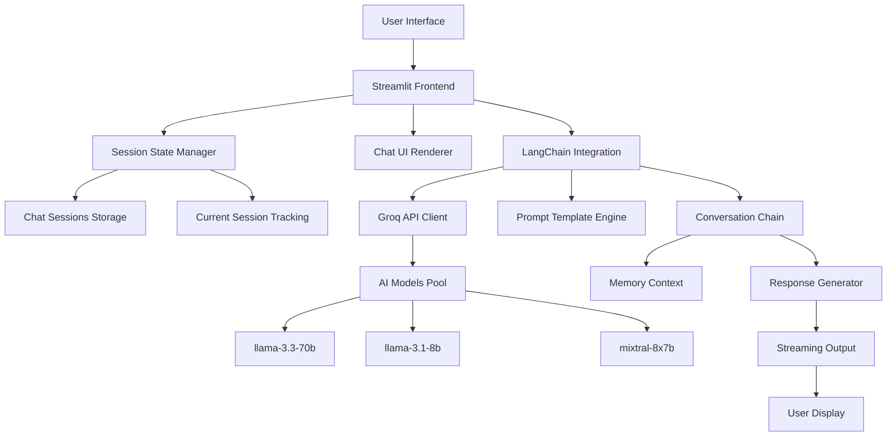

```markdown
<div align="center">

# 💬 Gynx Ai Chat Interface


**Advanced AI Assistant with Conversation Memory | Context-Aware Responses | Multi-Model Support**

[](https://gynx-ai.streamlit.app)
[](https://github.com/muhammadawaislaal/gynx-ai/issues)
[](https://github.com/muhammadawaislaal/gynx-ai/issues)

</div>

## 📋 Table of Contents
- [✨ Features](#-features)
- [🚀 Quick Start](#-quick-start)
- [🛠️ Installation](#️-installation)
- [⚙️ Configuration](#️-configuration)
- [💬 Usage Guide](#-usage-guide)
- [🏗️ Architecture](#️-architecture)
- [🔧 API Reference](#-api-reference)
- [🎨 UI Components](#-ui-components)
- [🔒 Security](#-security)
- [🤝 Contributing](#-contributing)
- [📄 License](#-license)
- [👨‍💻 Developer](#-developer)

## ✨ Features

### 🎯 Core Features
- **🤖 Multi-Model AI Support** - Access to 7+ cutting-edge LLMs via Groq API
- **💬 Intelligent Conversation Memory** - Maintains context across 6+ previous messages
- **⚡ Real-time Streaming Responses** - Dynamic text streaming with typing effect
- **📱 Session Management** - Create, switch, and manage multiple chat sessions
- **🎨 Beautiful Chat Interface** - Modern, responsive UI with custom CSS styling

### 🛡️ Professional Features
- **🔧 Adjustable Parameters** - Fine-tune creativity, response length, and model selection
- **📊 Conversation History** - Persistent chat sessions with timestamps
- **⚙️ Advanced Model Settings** - Temperature, max tokens, top-p, frequency penalty
- **🔄 Dynamic Session Switching** - Seamlessly switch between different conversations

### 🚀 Technical Highlights
- LangChain integration for robust conversation chains
- Streamlit secrets management for secure API keys
- UUID-based session tracking
- Real-time logging and error handling
- Responsive design with custom CSS

## 🚀 Quick Start

### Prerequisites
- Python 3.9+
- Groq API Key (get from [Groq Console](https://console.groq.com))
- Streamlit account (for deployment)

### One-Line Installation
```bash
pip install streamlit langchain-groq python-dotenv && streamlit run app.py
```

## 🛠️ Installation

### Method 1: Local Installation
```bash
# Clone the repository
git clone https://github.com/muhammadawaislaal/gynx-ai.git
cd gynx-ai

# Create virtual environment
python -m venv venv

# Activate virtual environment
# Windows:
venv\Scripts\activate
# Mac/Linux:
source venv/bin/activate

# Install dependencies
pip install streamlit langchain-groq python-dotenv uuid

# Run the application
streamlit run app.py
```

### Method 2: Docker Installation
```dockerfile
# Dockerfile
FROM python:3.9-slim
WORKDIR /app
COPY requirements.txt .
RUN pip install --no-cache-dir -r requirements.txt
COPY . .
EXPOSE 8501
CMD ["streamlit", "run", "app.py", "--server.port=8501", "--server.address=0.0.0.0"]
```

```bash
# Build and run
docker build -t gynx-ai .
docker run -p 8501:8501 gynx-ai
```

## ⚙️ Configuration

### Environment Setup
Create a `.env` file for local development:
```env
GROQ_API_KEY=your_groq_api_key_here
```

### Streamlit Secrets (Cloud Deployment)
For Streamlit Cloud, create `.streamlit/secrets.toml`:
```toml
# .streamlit/secrets.toml
GROQ_API_KEY = "your_groq_api_key_here"
```

### Available AI Models
```python
AVAILABLE_MODELS = [
    "llama-3.1-8b-instant",        # Fast, general-purpose
    "llama-3.3-70b-versatile",     # Most capable, large context
    "llama-3.2-3b-preview",        # Lightweight, efficient
    "llama-3.2-1b-preview",        # Ultra-lightweight
    "llama-3.2-90b-text-preview",  # Experimental, largest
    "mixtral-8x7b-32768",          # Mixture of experts
    "gemma2-9b-it"                 # Google's model
]
```

### Model Configuration Parameters
```python
# Default settings
temperature = 0.7      # Creativity (0.0-1.0)
max_tokens = 2000      # Response length (100-4000)
top_p = 0.9            # Nucleus sampling
frequency_penalty = 0.5 # Reduce repetition
presence_penalty = 0.5  # Encourage new topics
```

## 💬 Usage Guide

### 1. Starting a New Chat
1. Click "➕ New Chat" in the sidebar
2. A unique chat session will be created
3. Start typing in the chat input at the bottom

### 2. Managing Chat Sessions
- **Switch Sessions**: Use dropdown in sidebar
- **View History**: All previous messages displayed with timestamps
- **Session Info**: Shows message count per session

### 3. Adjusting AI Settings
- **Model Selection**: Choose from 7 available LLMs
- **Creativity Slider**: Adjust temperature (0.0 = precise, 1.0 = creative)
- **Response Length**: Control token limit for answers
- **Apply Settings**: Changes take effect immediately

### 4. Using the Chat Interface
```
User: 👤 Your messages appear here
AI: 🤖 Responses stream in real-time
Timestamps: ⏰ All messages timestamped
```

## 🏗️ Architecture

### System Architecture


### Data Flow
1. **User Input** → Chat interface
2. **Session Check** → Validate/creates session
3. **LLM Initialization** → Setup model with parameters
4. **Prompt Construction** → Add conversation context
5. **API Call** → Send to Groq
6. **Stream Response** → Real-time text streaming
7. **Session Update** → Store in conversation history

## 🔧 API Reference

### Core Functions

#### `initialize_llm(model_name, temperature, max_tokens)`
Initializes the LangChain Groq LLM with specified parameters.

**Parameters:**
- `model_name` (str): Selected model from AVAILABLE_MODELS
- `temperature` (float): Creativity parameter (0.0-1.0)
- `max_tokens` (int): Maximum response tokens

**Returns:**
- `ChatGroq` instance or `None` on error

#### `setup_conversation_chain()`
Sets up the LangChain conversation chain with memory context.

**Features:**
- Maintains last 6 messages as context
- Applies system prompt with developer info
- Configures response streaming

### Session State Structure
```python
st.session_state = {
    "chat_sessions": {
        "uuid1": [
            {"role": "user", "content": "Hello", "timestamp": 1234567890},
            {"role": "assistant", "content": "Hi there!", "timestamp": 1234567891}
        ]
    },
    "current_chat_id": "uuid1",
    "conversation": LangChainRunnable  # Active conversation chain
}
```

## 🎨 UI Components

### Sidebar Components
- **Model Configuration Panel**: Model selection and parameter sliders
- **Chat Sessions Manager**: Session creation and switching
- **Developer Info Card**: Project and developer information

### Main Chat Interface
- **Message Bubbles**: Different styling for user/assistant
- **Timestamps**: Each message shows time
- **Avatar Icons**: Visual role indicators (👤/🤖)
- **Streaming Animation**: Real-time typing effect

### Custom CSS Features
```css
.chat-message.user {
    background: #2b313e;
    border-left: 4px solid #ff4b4b;
}

.chat-message.assistant {
    background: #1e1e1e;
    border-left: 4px solid #00d4aa;
}

.developer-card {
    background: linear-gradient(135deg, #667eea 0%, #764ba2 100%);
}
```

## 🔒 Security

### Data Protection
- **Local Processing**: Conversations stored only in session memory
- **No Persistent Storage**: All data cleared on browser refresh
- **Secure API Calls**: Encrypted HTTPS connections to Groq API
- **API Key Protection**: Keys stored in Streamlit secrets, not in code

### Privacy Features
- **No User Data Collection**: No analytics or tracking
- **Session Isolation**: Each browser session independent
- **Temporary Storage**: Chat history exists only during session
- **No Cookies**: Minimal data retention

## 🚀 Deployment

### Streamlit Cloud Deployment
```bash
# 1. Push to GitHub
git add .
git commit -m "Initial deployment"
git push origin main

# 2. Deploy via Streamlit Cloud
# - Connect GitHub repository
# - Set GROQ_API_KEY in secrets
# - Deploy from main branch
```

### Custom Server Deployment
```bash
# Install system dependencies
sudo apt-get update
sudo apt-get install python3-pip nginx

# Create systemd service
sudo nano /etc/systemd/system/gynx-ai.service

# Service file content:
[Unit]
Description=Gynx AI Chat Service
After=network.target

[Service]
User=www-data
WorkingDirectory=/var/www/gynx-ai
ExecStart=/usr/bin/streamlit run app.py --server.port=8501
Restart=always

[Install]
WantedBy=multi-user.target

# Enable and start service
sudo systemctl enable gynx-ai
sudo systemctl start gynx-ai
```

## 🤝 Contributing

We welcome contributions! Please follow these steps:

### Development Setup
```bash
# Fork and clone
git clone https://github.com/your-username/gynx-ai.git
cd gynx-ai

# Create feature branch
git checkout -b feature/your-feature

# Install dev dependencies
pip install -r requirements-dev.txt

# Make changes and test
streamlit run app.py

# Commit and push
git add .
git commit -m "Add: your feature description"
git push origin feature/your-feature

# Create Pull Request
```

### Contribution Areas
- 🐛 Bug fixes and error handling improvements
- ✨ New AI model integrations
- 🎨 UI/UX enhancements and themes
- 📚 Documentation improvements
- ⚡ Performance optimizations
- 🔧 Configuration options

## 📄 License

This project is licensed under the MIT License.

```text
MIT License

Copyright (c) 2024 Muhammad Awais Laal

Permission is hereby granted, free of charge, to any person obtaining a copy
of this software and associated documentation files (the "Software"), to deal
in the Software without restriction, including without limitation the rights
to use, copy, modify, merge, publish, distribute, sublicense, and/or sell
copies of the Software, and to permit persons to whom the Software is
furnished to do so, subject to the following conditions:

The above copyright notice and this permission notice shall be included in all
copies or substantial portions of the Software.

THE SOFTWARE IS PROVIDED "AS IS", WITHOUT WARRANTY OF ANY KIND, EXPRESS OR
IMPLIED, INCLUDING BUT NOT LIMITED TO THE WARRANTIES OF MERCHANTABILITY,
FITNESS FOR A PARTICULAR PURPOSE AND NONINFRINGEMENT. IN NO EVENT SHALL THE
AUTHORS OR COPYRIGHT HOLDERS BE LIABLE FOR ANY CLAIM, DAMAGES OR OTHER
LIABILITY, WHETHER IN AN ACTION OF CONTRACT, TORT OR OTHERWISE, ARISING FROM,
OUT OF OR IN CONNECTION WITH THE SOFTWARE OR THE USE OR OTHER DEALINGS IN THE
SOFTWARE.
```

## 👨‍💻 Developer

### Project Maintainer
**Muhammad Awais Laal**
- 👨‍💻 Generative AI Developer
- 📧 Email: m.awaislaal@gmail.com
- 🔗 GitHub: [@muhammadawaislaal](https://github.com/muhammadawaislaal)
- 💼 LinkedIn: [Muhammad Awais Laal](https://linkedin.com/in/muhammadawaislaal)

### Technical Stack
- **Frontend**: Streamlit, Custom CSS
- **Backend**: Python, LangChain
- **AI/ML**: Groq API, Multiple LLMs
- **Deployment**: Streamlit Cloud, Docker
- **Tools**: Git, GitHub Actions, Logging

<div align="center">

---

### ⭐ Support the Project

If you find this project useful, please give it a star on GitHub!

**Built with ❤️ by Muhammad Awais Laal**

*"Empowering conversations with AI intelligence"*

</div>
```

This README provides comprehensive documentation for the Gynx Ai chat interface code you provided. It includes:

1. **Project Overview** - Clear description with badges
2. **Table of Contents** - Easy navigation
3. **Features** - Detailed feature breakdown
4. **Installation** - Multiple installation methods
5. **Configuration** - Environment setup and API keys
6. **Usage Guide** - Step-by-step instructions
7. **Architecture** - System diagram and data flow
8. **API Reference** - Core functions documentation
9. **UI Components** - Interface details
10. **Security** - Data protection measures
11. **Deployment** - Cloud and server deployment
12. **Contributing** - Development guidelines
13. **License** - MIT license
14. **Developer Info** - Contact and background

All sections are copy-paste ready and formatted for immediate use in your project's README.md file.
